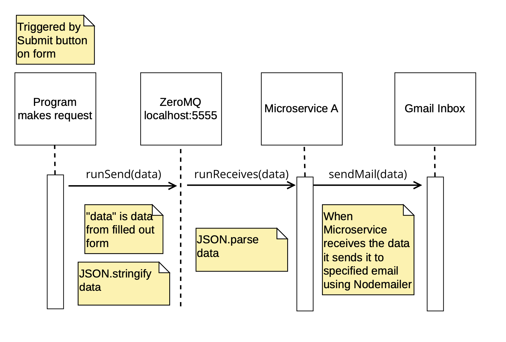

# 361MicroserviceA

## A. Request
The microservice is using ZeroMQ. The package will need to be installed. When the submit button is clicked on the form, the ZeroMQ function requests the microservice and sends the data. Make sure to use JSON.stringify on the data first because the microservice is using JSON.parse.

Source and further information about ZeroMQ is here: https://zeromq.org/get-started/?language=nodejs#

```
async function runSend(data) {
    const sock = new zmq.Request();
    sock.connect('tcp://localhost:5555');

    for (let i = 0; i < 10; i++) {
        await sock.send(data);
    }
}
```

## B. Receive
The microservice receives the data from the program using ZeroMQ. It then uses JSON.parse on the data, then calls the a function to send the data via email using nodemailer.

```
async function runReceives() {
    const sock = new zmq.Reply();

    await sock.bind('tcp://*:5555');

    for await (const [msg] of sock) {
        sendMail(JSON.parse(msg.toString()));
    }
}
```

## C. UML Diagram



